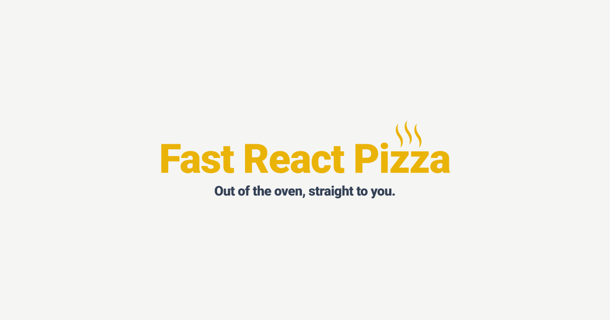

# Fast React Pizza 🍕



Welcome to the Fast React Pizza project! This application is designed to provide a seamless pizza ordering experience, allowing users to browse the menu, add items to their cart, and place orders effortlessly. Built with React and utilizing modern web technologies, this project showcases the power of React in creating dynamic and responsive user interfaces.

## Technologies Used

- React ⚛️
- Redux Toolkit
- React Router
- Tailwind CSS 🎨
- Vite ⚡

## Table of Contents

- [Features](#features)
- [Installation](#installation)
- [Usage](#usage)
- [Project Structure](#project-structure)
- [Acknowledgments](#acknowledgments)

## Features

- **Dynamic Menu**: Browse a variety of pizzas and toppings, with real-time updates.
- **Shopping Cart**: Add, update, and remove items from your cart with ease.
- **Order Management**: Place orders and view order history.
- **Responsive Design**: Optimized for both desktop and mobile devices.

## Installation

To get started with the Fast React Pizza project, follow these steps:

1. **Clone the repository**:
   ```bash
   git clone https://github.com/yourusername/fast-react-pizza.git
   ```
2. **Navigate to the project directory**:
   ```bash
   cd fast-react-pizza
   ```
3. **Install dependencies**:
   ```bash
   npm install
   ```
4. **Run the application**:
   ```bash
   npm run dev
   ```
5. Open your browser and navigate to `http://localhost:3000` to view the application.

## Usage

Once the application is running, you can:

- Sign up or log in to your account.
- Browse the menu and add items to your cart.
- Proceed to checkout to place your order.

## Project Structure

The project is organized into several key directories:

- **src/**: Contains all the source code for the application.
  - **features/**: Contains feature-specific components and slices for state management.
  - **services/**: Includes API service files for handling data fetching.
  - **ui/**: Contains reusable UI components.
  - **utils/**: Utility functions to support various functionalities.

## Acknowledgments

This project is a part of Jonas's Ultimate React Course. The course provides comprehensive insights into React development, and this project serves as a practical application of the concepts learned.

Thank you for checking out the Fast React Pizza project! We hope you enjoy using it as much as we enjoyed building it.
